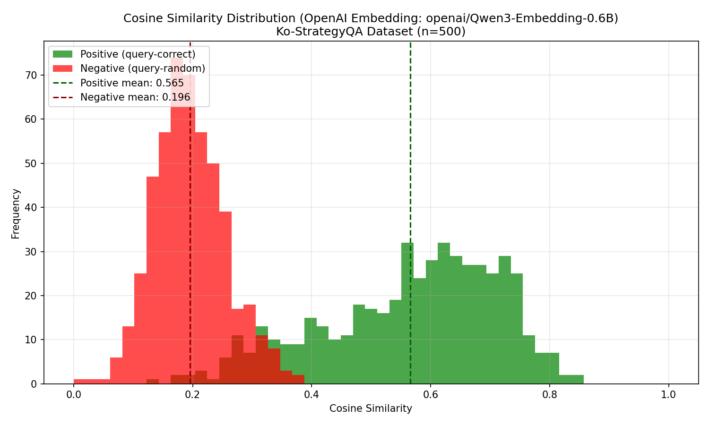

# Ko-StrategyQA
한국어 ODQA multi-hop 검색 데이터셋 (StrategyQA 번역)
- huggingface [taeminlee/Ko-StrategyQA](https://huggingface.co/datasets/taeminlee/Ko-StrategyQA)


## Perf
### Ko
```
--- Results @ k=5 ---
                          Recall@5  Precision@5  nDCG@5    MRR    MAP
Config                                                               
dense                       0.7753       0.2814  0.7370 0.7820 0.7088
sparse (BM25 korean)        0.6353       0.2216  0.5811 0.6412 0.5494
hybrid (RRF k=60)           0.7460       0.2659  0.7039 0.7609 0.6745
hybrid (RRF k=60, d=0.7)    0.7615       0.2726  0.7171 0.7669 0.6900
hybrid (RRF k=30, d=0.7)    0.7703       0.2767  0.7232 0.7687 0.6956
hybrid (RRF k=20)           0.7508       0.2672  0.7079 0.7650 0.6817

--- Results @ k=10 ---
                          Recall@10  Precision@10  nDCG@10    MRR    MAP
Config                                                                  
dense                        0.8218        0.1515   0.7559 0.7820 0.7088
sparse (BM25 korean)         0.7182        0.1274   0.6136 0.6412 0.5494
hybrid (RRF k=60)            0.8021        0.1461   0.7273 0.7609 0.6745
hybrid (RRF k=60, d=0.7)     0.8220        0.1508   0.7425 0.7669 0.6900
hybrid (RRF k=30, d=0.7)     0.8316        0.1530   0.7491 0.7687 0.6956
hybrid (RRF k=20)            0.8191        0.1500   0.7368 0.7650 0.6817

--- Results @ k=20 ---
                          Recall@20  Precision@20  nDCG@20    MRR    MAP
Config                                                                  
dense                        0.8560        0.0793   0.7665 0.7820 0.7088
sparse (BM25 korean)         0.7646        0.0689   0.6285 0.6412 0.5494
hybrid (RRF k=60)            0.8479        0.0785   0.7422 0.7609 0.6745
hybrid (RRF k=60, d=0.7)     0.8636        0.0802   0.7557 0.7669 0.6900
hybrid (RRF k=30, d=0.7)     0.8632        0.0802   0.7592 0.7687 0.6956
hybrid (RRF k=20)            0.8608        0.0799   0.7504 0.7650 0.6817

======================================================================
Summary Table
======================================================================
                            R@5  nDCG@5   R@10  nDCG@10   R@20  nDCG@20    MRR    MAP
Config                                                                               
dense                    0.7753  0.7370 0.8218   0.7559 0.8560   0.7665 0.7820 0.7088
sparse (BM25 korean)     0.6353  0.5811 0.7182   0.6136 0.7646   0.6285 0.6412 0.5494
hybrid (RRF k=60)        0.7460  0.7039 0.8021   0.7273 0.8479   0.7422 0.7609 0.6745
hybrid (RRF k=60, d=0.7) 0.7615  0.7171 0.8220   0.7425 0.8636   0.7557 0.7669 0.6900
hybrid (RRF k=30, d=0.7) 0.7703  0.7232 0.8316   0.7491 0.8632   0.7592 0.7687 0.6956
hybrid (RRF k=20)        0.7508  0.7079 0.8191   0.7368 0.8608   0.7504 0.7650 0.6817
```

### En
```
--- Results @ k=5 ---
                          Recall@5  Precision@5  nDCG@5    MRR    MAP
Config                                                               
dense                       0.8536       0.3135  0.8255 0.8530 0.8063
sparse (BM25 english)       0.7431       0.2652  0.6807 0.7191 0.6509
hybrid (RRF k=60)           0.8256       0.3007  0.7881 0.8264 0.7658
hybrid (RRF k=60, d=0.7)    0.8476       0.3098  0.8065 0.8332 0.7830
hybrid (RRF k=30, d=0.7)    0.8536       0.3128  0.8120 0.8356 0.7882
hybrid (RRF k=20)           0.8371       0.3044  0.7943 0.8280 0.7701

--- Results @ k=10 ---
                          Recall@10  Precision@10  nDCG@10    MRR    MAP
Config                                                                  
dense                        0.8864        0.1652   0.8397 0.8530 0.8063
sparse (BM25 english)        0.8153        0.1488   0.7107 0.7191 0.6509
hybrid (RRF k=60)            0.8815        0.1628   0.8110 0.8264 0.7658
hybrid (RRF k=60, d=0.7)     0.8885        0.1650   0.8237 0.8332 0.7830
hybrid (RRF k=30, d=0.7)     0.8874        0.1650   0.8264 0.8356 0.7882
hybrid (RRF k=20)            0.8891        0.1650   0.8161 0.8280 0.7701

--- Results @ k=20 ---
                          Recall@20  Precision@20  nDCG@20    MRR    MAP
Config                                                                  
dense                        0.9021        0.0845   0.8448 0.8530 0.8063
sparse (BM25 english)        0.8522        0.0786   0.7224 0.7191 0.6509
hybrid (RRF k=60)            0.9028        0.0842   0.8183 0.8264 0.7658
hybrid (RRF k=60, d=0.7)     0.9098        0.0853   0.8308 0.8332 0.7830
hybrid (RRF k=30, d=0.7)     0.9112        0.0854   0.8342 0.8356 0.7882
hybrid (RRF k=20)            0.9077        0.0848   0.8223 0.8280 0.7701

======================================================================
Summary Table
======================================================================
                            R@5  nDCG@5   R@10  nDCG@10   R@20  nDCG@20    MRR    MAP
Config                                                                               
dense                    0.8536  0.8255 0.8864   0.8397 0.9021   0.8448 0.8530 0.8063
sparse (BM25 english)    0.7431  0.6807 0.8153   0.7107 0.8522   0.7224 0.7191 0.6509
hybrid (RRF k=60)        0.8256  0.7881 0.8815   0.8110 0.9028   0.8183 0.8264 0.7658
hybrid (RRF k=60, d=0.7) 0.8476  0.8065 0.8885   0.8237 0.9098   0.8308 0.8332 0.7830
hybrid (RRF k=30, d=0.7) 0.8536  0.8120 0.8874   0.8264 0.9112   0.8342 0.8356 0.7882
hybrid (RRF k=20)        0.8371  0.7943 0.8891   0.8161 0.9077   0.8223 0.8280 0.7701
```


## Analysis
### Embedding Similarity Diff
Qwen3-Embedding-0.6B
```
=== Cosine Similarity Statistics ===
Positive (query-correct): mean=0.5655, std=0.1483, min=0.1273, max=0.8496
Negative (query-random):  mean=0.1957, std=0.0595, min=0.0200, max=0.3813
```

