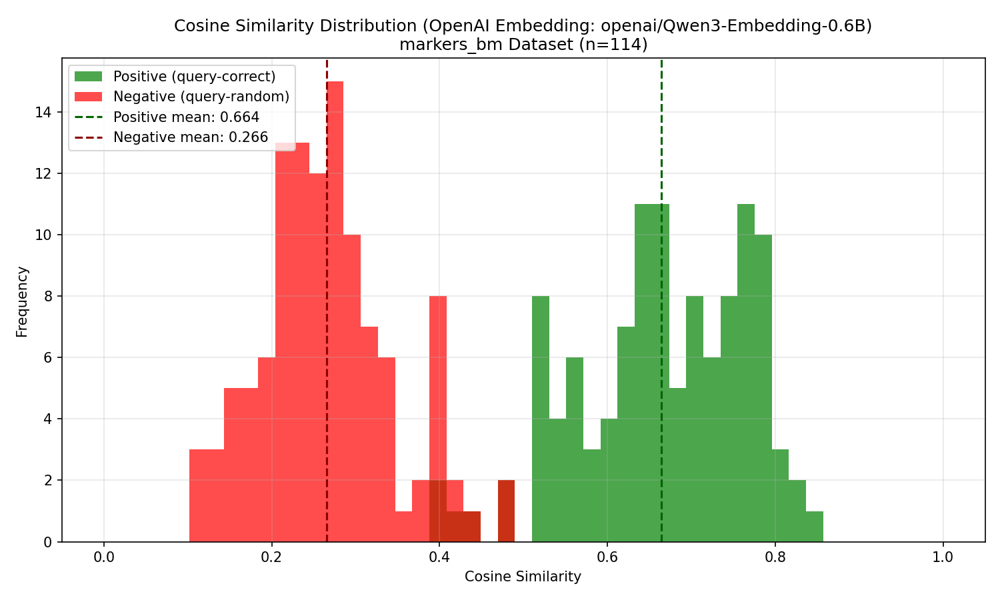

# markers_bm Example

Korean retrieval evaluation using the markers_bm dataset.

## Perf
```
--- Results @ k=5 ---
                          Recall@5  Precision@5  nDCG@5    MRR    MAP
Config                                                               
dense                       0.9035       0.1807  0.8055 0.7802 0.7802
sparse (BM25 korean)        1.0000       0.2000  0.9380 0.9170 0.9170
hybrid (RRF k=60)           0.9649       0.1930  0.8666 0.8368 0.8368
hybrid (RRF k=60, d=0.7)    0.9386       0.1877  0.8320 0.8024 0.8024
hybrid (RRF k=30, d=0.7)    0.9298       0.1860  0.8286 0.8023 0.8023
hybrid (RRF k=20)           0.9737       0.1947  0.8700 0.8380 0.8380

--- Results @ k=10 ---
                          Recall@10  Precision@10  nDCG@10    MRR    MAP
Config                                                                  
dense                        0.9561        0.0956   0.8219 0.7802 0.7802
sparse (BM25 korean)         1.0000        0.1000   0.9380 0.9170 0.9170
hybrid (RRF k=60)            0.9825        0.0982   0.8723 0.8368 0.8368
hybrid (RRF k=60, d=0.7)     0.9737        0.0974   0.8435 0.8024 0.8024
hybrid (RRF k=30, d=0.7)     0.9737        0.0974   0.8434 0.8023 0.8023
hybrid (RRF k=20)            0.9912        0.0991   0.8756 0.8380 0.8380

--- Results @ k=20 ---
                          Recall@20  Precision@20  nDCG@20    MRR    MAP
Config                                                                  
dense                        0.9737        0.0487   0.8264 0.7802 0.7802
sparse (BM25 korean)         1.0000        0.0500   0.9380 0.9170 0.9170
hybrid (RRF k=60)            1.0000        0.0500   0.8768 0.8368 0.8368
hybrid (RRF k=60, d=0.7)     0.9912        0.0496   0.8481 0.8024 0.8024
hybrid (RRF k=30, d=0.7)     0.9912        0.0496   0.8480 0.8023 0.8023
hybrid (RRF k=20)            1.0000        0.0500   0.8780 0.8380 0.8380

======================================================================
Summary Table
======================================================================
                            R@5  nDCG@5   R@10  nDCG@10   R@20  nDCG@20    MRR    MAP
Config                                                                               
dense                    0.9035  0.8055 0.9561   0.8219 0.9737   0.8264 0.7802 0.7802
sparse (BM25 korean)     1.0000  0.9380 1.0000   0.9380 1.0000   0.9380 0.9170 0.9170
hybrid (RRF k=60)        0.9649  0.8666 0.9825   0.8723 1.0000   0.8768 0.8368 0.8368
hybrid (RRF k=60, d=0.7) 0.9386  0.8320 0.9737   0.8435 0.9912   0.8481 0.8024 0.8024
hybrid (RRF k=30, d=0.7) 0.9298  0.8286 0.9737   0.8434 0.9912   0.8480 0.8023 0.8023
hybrid (RRF k=20)        0.9737  0.8700 0.9912   0.8756 1.0000   0.8780 0.8380 0.8380
```

## Analysis
### Embedding Similarity Diff
Qwen3-Embedding-0.6B
```
=== Cosine Similarity Statistics ===
Positive (query-correct): mean=0.6644, std=0.1010, min=0.3917, max=0.8469
Negative (query-random):  mean=0.2657, std=0.0787, min=0.1023, max=0.4777
```

